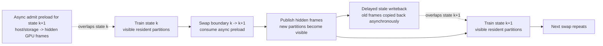
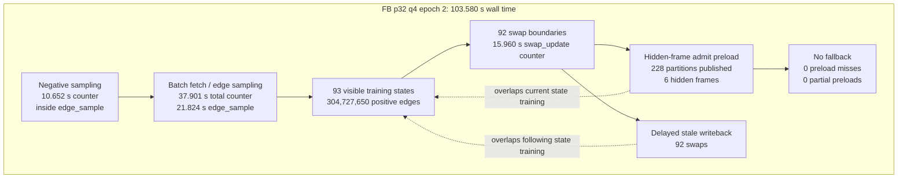
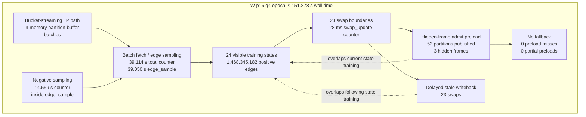
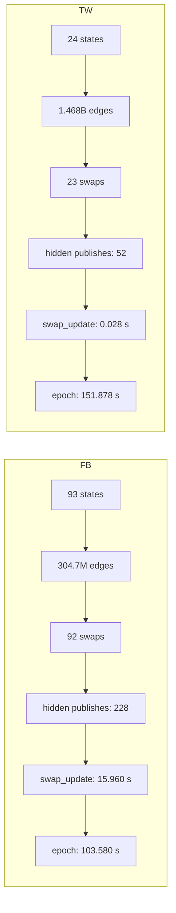

# FB and TW Epoch-Time Flow: Partition-Side Overlap

This note describes the measured epoch-time flow for the fast single-GPU FB and
TW runs at commit `fed9d052c8d0b31004a4fbda000f5cc7774a5e62`.

Rendered image files:

- `experiment_logs/fb_tw_epoch_time_flow_partition_overlap_20260506.png`
- `experiment_logs/fb_tw_epoch_time_flow_partition_overlap_20260506.svg`

The diagrams focus on the partition-buffer side: async admit preload into hidden
frames, hidden-frame publish at the swap boundary, and delayed stale writeback.
The prepared-batch trainer pipeline is off in both runs.

Important: the timing counters below are hierarchical and partly overlapped.
Do not sum `batch_fetch`, `edge_sample`, `negative_sampler`, and `swap_update`
to recover epoch wall time.

## Run Inputs

| Dataset | Run | Epoch used | Wall time | States | Swaps | Partition-side pipeline state |
|---|---|---:|---:|---:|---:|---|
| FB p32 q4 | `fb86m_p32_q4_bounded_minmax_10frames_fed9_py312_3e_20260506_200625` | 2 | 103.580 s | 93 | 92 | hidden preload on, delayed stale writeback on, no fallback |
| TW p16 q4 | `tw16p_best150_bounded_bs150k_bneg8_hf3_fed9_10e_20260506_233608` | 2 | 151.878 s | 24 | 23 | hidden preload on, delayed stale writeback on, no fallback |

## Shared Partition-Side Flow



What this means:

1. While state `k` is training, the next state's admitted partitions are loaded
   into hidden GPU frames.
2. At the swap boundary, the preloaded hidden frames are published into the
   visible logical slots.
3. The old visible frames become stale. Their writeback is delayed and launched
   asynchronously, so most of that work overlaps the next state's training.
4. If hidden frames are fewer than admitted partitions, the remaining admits
   fall back to visible install on the swap boundary. The fixed TW run avoids
   this by using 3 hidden frames for max 3 admits.

## FB p32 q4 Flow

Measured from epoch 2 of:

`/home/smansou2/codex_runs/exp_logs/fb86m_p32_q4_bounded_minmax_10frames_fed9_py312_3e_20260506_200625_train.log`

Key settings and scheduler fingerprint:

```text
GEGE_PREPARED_BATCH_PIPELINE=0
GEGE_PREFETCH_PREPARE_NEXT_PARTITION=0
GEGE_BUCKET_STREAMING_LP=0
GEGE_FRAME_CACHE_HIDDEN_FRAMES=6
states=93 transitions=92 total_buckets=1024
max_admits=3 transition_admits=228
admit_hist=[2:48, 3:44]
```

Measured counters:

```text
Epoch Runtime: 103580ms
batch_fetch.total_ms=37900.538
batch_fetch.get_next_swap_path_ms=16024.051
edge_sample.total_ms=21823.605
negative_sampler.call_ms_total=10652.357
swap_count=92
swap_update_ms=15960.444
hidden_publish_parts=228
fallback_visible_admit_parts=0
preload_miss_swaps=0
partial_preload_swaps=0
delayed_stale_writeback_swaps=92
async_admit_valid_before_swap_swaps=92
```



FB interpretation:

```text
Critical path:
  visible state training + batch generation + swap boundary publish/rebuild

Overlapped:
  next-state partition admit preload into hidden frames
  stale-frame writeback after hidden publish

Not present:
  prepared-batch trainer pipeline
  bucket-streaming LP
  visible-admit fallback
```

FB has enough hidden frames for every transition because the scheduler admits at
most 3 partitions per transition and the run has 6 hidden frames. The frame-cache
counter confirms every swap had valid async preload before the swap.

## TW p16 q4 Flow

Measured from epoch 2 of the fixed no-fallback run:

`/home/smansou2/codex_runs/exp_logs/tw16p_best150_bounded_bs150k_bneg8_hf3_fed9_10e_20260506_233608_train.log`

Key settings and scheduler fingerprint:

```text
GEGE_PREPARED_BATCH_PIPELINE=0
GEGE_PREFETCH_PREPARE_NEXT_PARTITION=0
GEGE_BUCKET_STREAMING_LP=1
GEGE_FRAME_CACHE_HIDDEN_FRAMES=3
states=24 transitions=23 total_buckets=256
max_admits=3 transition_admits=52
admit_hist=[1:1, 2:15, 3:7]
```

Measured counters:

```text
Epoch Runtime: 151878ms
batch_fetch.total_ms=39113.941
batch_fetch.get_next_swap_path_ms=43.215
edge_sample.total_ms=39049.988
negative_sampler.call_ms_total=14558.509
swap_count=23
swap_update_ms=28.059
hidden_publish_parts=52
fallback_visible_admit_parts=0
preload_miss_swaps=0
partial_preload_swaps=0
delayed_stale_writeback_swaps=23
async_admit_valid_before_swap_swaps=23
```



TW interpretation:

```text
Critical path:
  visible state training + bucket-streamed edge sampling / negative sampling

Overlapped:
  next-state partition admit preload into hidden frames
  stale-frame writeback after hidden publish

Not present:
  prepared-batch trainer pipeline
  visible-admit fallback after increasing hidden frames from 2 to 3
```

The earlier `hf2` TW run had 2 hidden frames while 7 transitions admitted 3
partitions. That caused:

```text
fallback_visible_admit_parts=7
partial_preload_swaps=7
```

The fixed `hf3` run matches the scheduler max admit count, so all 52 admitted
partitions are hidden-published and no visible fallback remains.

## Side-by-Side Critical Path Difference



Main takeaway:

```text
FB spends visible time on many more state transitions and swap-boundary work,
but processes fewer total edges.

TW now hides partition admission/writeback cleanly; its epoch time is dominated
by edge sampling, negative sampling, map lookup, compute, and update across a
much larger edge count, not by partition fallback.
```
